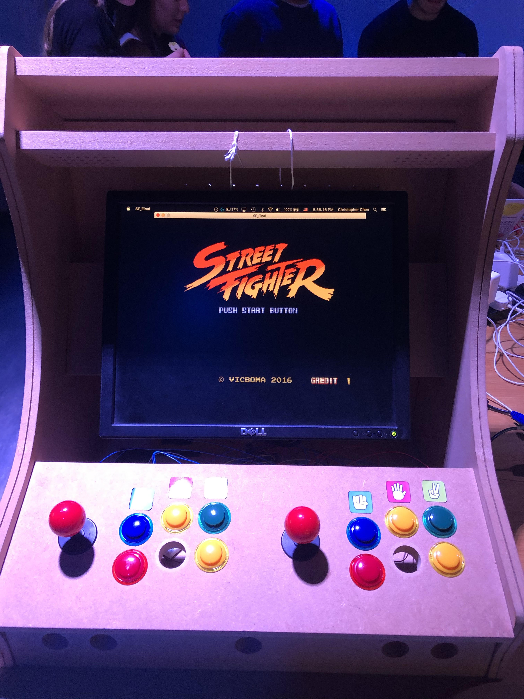
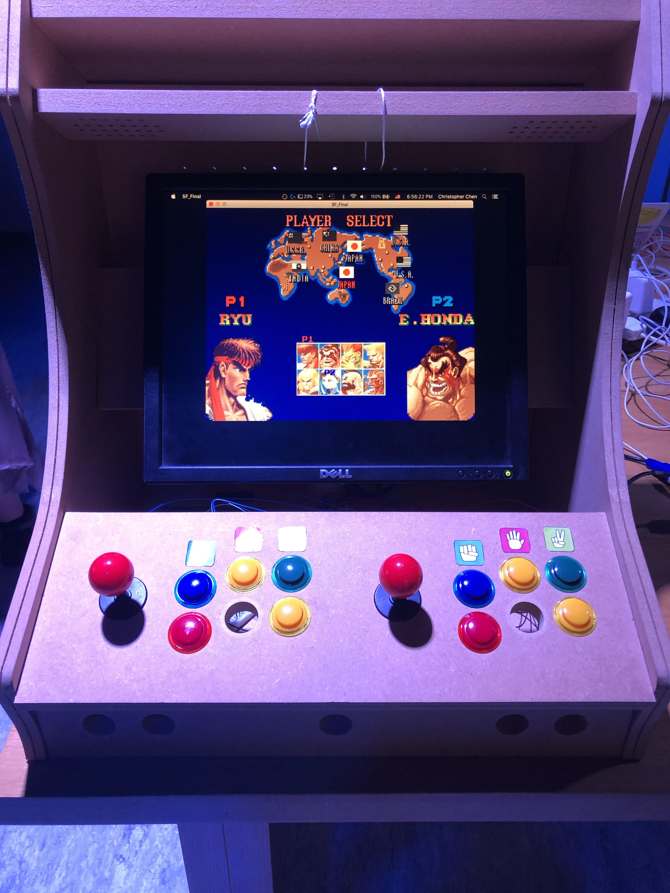

# Street_Fight_RPC

Street Fighter Rock Paper Scissors is my attempt at recreating the classic Streetfighter game with a slight twist: players battle with rock paper scissors. It is a two player game. Players are able to pick from eight different characters, including Ryu, Ken, Chun-Li, Guile, and E. Honda, each with their own animations. 

This game differs slightly from a normal rock paper scissors. Instead of a typical game, players can pick what they're going to use (rock, paper or scissors) before the countdown. Their choices are indicated above their character. However, the user is free to change it anytime before the countdown. For example, player one can indicate that they are going to use scissors and switch it last second to paper to beat out player two's rock. This adds another element of mindreading and adds more interactivity to a normal rock paper scissor game.

I created this game with Processing, a graphical library and integrated development environment and an Arduino. Most of the game logic along with the character's animations is done within Processing (Java) while the Arduino links the game to the buttons and the joystick. To connect the Arduino and joystick/buttons, it required soldering the wires into the Arduino board itself. 

Although I haven't deployed it live, you can check it out by downloading it. An Arduino board and joystick/buttons are not required and the game can be played with the keyboard. 

I have attached some photos from the Interactive Media Showcase 2019 in which I demonstrated my creation.

This is what the loading screen looks like:

This is the character selection screen:

This is a short video of people playing:
